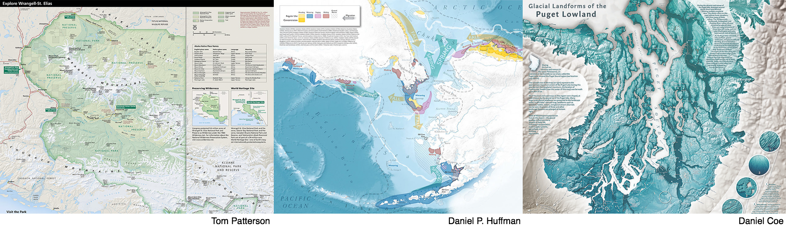

<small>2018 <a href="http://atlasofdesign.org/">NACIS Atlas of Design</a> submissions</small>

The purpose of this tutorial is to 1) *foster a working knowledge* of basic geospatial visualization tools in Python and 2) *expose participants* to the wide landscape of spatial visualization tools, both programmatic (using code, e.g. `cartopy`) and graphical (by clicking, e.g. Tableau, ArcGIS). It is based on the lesson template used in [Data Carpentry]({{ site.dc_site }})
and [Software Carpentry]({{ site.swc_site }}) workshops and was written by [Tony Cannistra](http://www.anthonycannistra.com/about) with lesson development by Tony and [Randy LeVeque](http://faculty.washington.edu/rjl/). 

